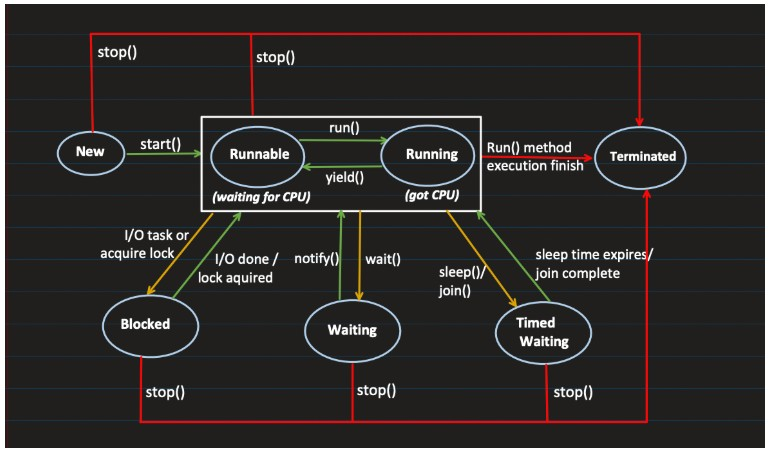

### Multithreading Terminology - Fast Track Guide

#### CPU & Core
- **CPU (Central Processing Unit):** Executes program instructions.
- **Core:** An independent processing unit within a CPU. More cores enable true parallel execution.
  - Example: A **quad-core processor** can run four tasks simultaneously (e.g., web browser, music player, downloads, system updates).

#### Program vs. Process vs. Thread
- **Program:** A set of instructions written in a programming language (e.g., Microsoft Word).
- **Process:** An instance of a running program. The OS manages its execution.
  - Example: Opening **Microsoft Word** creates a new process.
- **Thread:** The smallest unit of execution within a process. Threads share resources but execute independently.
  - Example: A **web browser** runs multiple threads—one for rendering, one for JavaScript, one for user input.

#### Multitasking vs. Multithreading
- **Multitasking:** Running multiple processes simultaneously.
  - **Single-core CPU:** Uses time-sharing (rapid switching).
  - **Multi-core CPU:** Runs tasks in true parallel.
  - Example: Browsing the internet while listening to music and downloading a file.
- **Multithreading:** Running multiple threads **within the same process**.
  - Example: A web browser using separate threads for rendering, scripting, and user interaction.

#### Key Mechanism: Context Switching
- **Definition:** The OS saves the state of a running process/thread and loads the next one.
- **Purpose:** Allows multiple processes/threads to share the CPU efficiently.
  - **Single-core CPU:** Creates an **illusion** of parallel execution.
  - **Multi-core CPU:** Enables **true** parallel execution by distributing tasks across cores.

#### Multitasking vs. Multithreading – Key Difference
- **Multitasking:** Manages **multiple applications** (processes).
- **Multithreading:** Manages **multiple threads** within a **single** application/process.

---

### Concurrency vs. Parallelism

#### 🚀 Concurrency
#### **Definition**
> Concurrency means executing multiple tasks **in overlapping time periods**, but **not necessarily at the same time**.

#### **Example**
Imagine you are **singing** and **eating** at the same time. Since both require your mouth, you cannot do them **simultaneously**. Instead, you will **switch between them**, i.e., eat for some time, then sing, then eat again. 

🔹 **Concurrency = Task Switching** (one task at a time, but switching between tasks quickly)

#### **How It Works in Computers?**
- In a **single-core processor**, concurrency is achieved using **context switching**, where the CPU rapidly switches between tasks.

```plaintext
Task 1 -> Task 2 -> Task 1 -> Task 2 (Switching back and forth)
```

---

#### ⚡ Parallelism
#### **Definition**
> Parallelism means executing multiple tasks **simultaneously** at the same time.

#### **Example**
Imagine you are **cooking** while **talking on the phone**. Both actions can happen at the same time because they use different resources (hands for cooking, mouth for talking).

🔹 **Parallelism = Tasks running at the same time on multiple resources**

#### **How It Works in Computers?**
- In a **multi-core processor**, tasks can run truly **in parallel**, meaning different tasks run on different cores **without switching**.

```plaintext
Task 1 | Task 2 (Executing at the same time on different cores)
```

---

#### 🔄 Concurrency vs. Parallelism
| Feature       | Concurrency | Parallelism |
|--------------|------------|------------|
| Execution | Tasks start, run, and complete in overlapping time but **not simultaneously** | Tasks run **at the same time** |
| Example | Singing & Eating (Switching) | Cooking & Talking (Simultaneous) |
| Processor | Works on **single-core** | Requires **multi-core** |
| Technique | **Context Switching** | **True Parallel Execution** |

---

#### 🔗 How They Are Related?
✅ **Concurrency enables Parallelism** when multiple cores are available.  
✅ In a **single-core CPU**, tasks execute **one after another** using **context switching**.  
✅ In a **multi-core CPU**, tasks can be executed **truly in parallel** without switching.  

---

#### 🏁 Conclusion
- **Use Concurrency** when you have a **single-core CPU** or want to efficiently switch between multiple tasks.
- **Use Parallelism** when you have a **multi-core CPU** and want to perform tasks **truly simultaneously**.

---

#### What are the ways to Create Threads in Java ?
Java provides two main ways to create threads:

#### 1. Extending `Thread` Class
```java
class MyThread extends Thread {
    public void run() {
        System.out.println("Thread running...");
    }
    public static void main(String[] args) {
        MyThread t = new MyThread();
        t.start(); // Starts a new thread
    }
}
```

#### 2. Implementing `Runnable` Interface
```java
class MyRunnable implements Runnable {
    public void run() {
        System.out.println("Thread running...");
    }
    public static void main(String[] args) {
        Thread t = new Thread(new MyRunnable());
        t.start(); // Starts a new thread
    }
}
```


### 3. Using ExecutorService interface

The `ExecutorService` provides a higher-level way to manage threads efficiently, often using a thread pool. It is part of the `java.util.concurrent` package and helps in managing multiple threads with ease.

#### Example
```java
import java.util.concurrent.ExecutorService;
import java.util.concurrent.Executors;

public class Main {
    public static void main(String[] args) {
        ExecutorService executor = Executors.newSingleThreadExecutor();
        executor.submit(() -> System.out.println("Thread is running..."));
        executor.shutdown(); // Clean up
    }
}
```

#### Advantages
- Reuses threads, reducing overhead.
- Better for managing multiple threads efficiently.
- Provides methods for lifecycle management of threads.

#### Notes
- Always call `shutdown()` to release resources when the executor is no longer needed.
- Use different types of executors (`newFixedThreadPool`, `newCachedThreadPool`, etc.) based on the requirements.
---
### 4. Using Lambda Expression

Lambda expressions provide a concise way to express instances of functional interfaces in Java 8 and later. One common use case is simplifying thread creation using `Runnable` or `ExecutorService`.

#### Example: Using Lambda with Runnable
```java
public class Main {
    public static void main(String[] args) {
        Thread thread = new Thread(() -> System.out.println("Thread is running..."));
        thread.start();
    }
}
```

#### Key Points

#### 1. `start()` vs `run()`
- **Use `start()`** to create and start a new thread.
- **Calling `run()` directly** executes the code in the current thread, not a new one.

#### 2. Thread Safety
- When multiple threads access shared resources, use **synchronization mechanisms** (e.g., `synchronized` blocks/methods) to prevent race conditions.

#### 3. Modern Preference: ExecutorService
- Instead of manually creating threads, **ExecutorService** is recommended for better thread management and resource utilization.
- Example using `ExecutorService`:

```java
import java.util.concurrent.ExecutorService;
import java.util.concurrent.Executors;

public class ExecutorExample {
    public static void main(String[] args) {
        ExecutorService executor = Executors.newSingleThreadExecutor();
        executor.execute(() -> System.out.println("Task executed using ExecutorService"));
        executor.shutdown();
    }
}
```

Using `ExecutorService` allows better control over thread lifecycle and avoids unnecessary thread creation overhead.

---

By using lambda expressions with `Runnable` and `ExecutorService`, Java developers can write cleaner and more efficient multithreading code.

### 5. Using Callable and Future with ExecutorService

Unlike `Runnable`, which cannot return a result or throw checked exceptions, the `Callable` interface allows a thread to:
- Return a computed value.
- Throw checked exceptions.

It is typically used with `ExecutorService` and paired with `Future` to retrieve the result asynchronously.

---

#### Steps to Implement:
1. Implement the `Callable` interface and override the `call()` method.
2. Submit the `Callable` task to an `ExecutorService`.
3. Retrieve the result using a `Future` object.
4. Shut down the `ExecutorService` after execution.

---

#### Code Example
```java
import java.util.concurrent.*;

public class Main {
    public static void main(String[] args) throws Exception {
        // Create an ExecutorService with a single thread
        ExecutorService executor = Executors.newSingleThreadExecutor();
        
        // Define a Callable task that returns a result
        Callable<String> callable = () -> {
            Thread.sleep(1000); // Simulate work
            return "Task completed!";
        };

        // Submit the task and receive a Future object
        Future<String> future = executor.submit(callable);
        
        // Retrieve and print the result (blocks until available)
        System.out.println(future.get());
        
        // Shutdown the executor
        executor.shutdown();
    }
}
```

---

#### Key Points:
✅ `Callable<T>` returns a result, unlike `Runnable`.
✅ Use `Future<T>` to obtain the result asynchronously.
✅ `future.get()` blocks until the computation is complete.
✅ Always shutdown the `ExecutorService` after execution.

---

#### Use Case
📌 When you need a thread to perform a computation and return a result, such as:
- Fetching data from an external source.
- Performing a complex calculation.
- Executing background tasks with results.

---

#### 🔥 Pro Tip
Instead of blocking with `future.get()`, use `isDone()` to check if the task is complete before retrieving the result:
```java
if (future.isDone()) {
    System.out.println(future.get());
}
```
This approach avoids unnecessary blocking and improves performance.

---

### 6. Using ThreadPoolExecutor Directly

While `ExecutorService` (e.g., via `Executors.newFixedThreadPool()`) is a common abstraction, using `ThreadPoolExecutor` directly provides more fine-grained control over thread pool configurations. This allows you to specify parameters such as:
- Core pool size
- Maximum pool size
- Keep-alive time
- Task queue type and capacity

#### Example Usage
Below is an example demonstrating how to use `ThreadPoolExecutor` directly:

```java
import java.util.concurrent.*;

public class Main {
    public static void main(String[] args) {
        // Creating a ThreadPoolExecutor with custom settings
        ThreadPoolExecutor executor = new ThreadPoolExecutor(
            2, // Core pool size
            4, // Maximum pool size
            60L, // Keep-alive time
            TimeUnit.SECONDS, // Time unit
            new LinkedBlockingQueue<>() // Task queue
        );

        // Submitting a task for execution
        executor.execute(() -> System.out.println("Thread is running..."));

        // Shutdown the executor after task execution
        executor.shutdown();
    }
}
```

#### Use Case
You should use `ThreadPoolExecutor` directly when:
- You need custom thread pool behavior beyond the defaults provided by `Executors` factory methods.
- You want to fine-tune thread pool parameters for specific performance needs.
- You need to handle task rejection policies or manage queue types explicitly.

By understanding and configuring `ThreadPoolExecutor`, you can optimize resource usage and improve application performance efficiently.


### 7. ForkJoinPool and Recursive Task Execution


The `ForkJoinPool` is a specialized `ExecutorService` designed for parallel processing of recursive, divide-and-conquer algorithms. It is particularly useful for tasks like sorting (quicksort, merge sort) and parallel computation.

#### Key Components:
- **ForkJoinPool**: Manages and executes ForkJoinTasks in parallel.
- **RecursiveTask<T>**: A subclass of `ForkJoinTask` that returns a result.
- **RecursiveAction**: A subclass of `ForkJoinTask` that does not return a result.

#### Example: Using `ForkJoinPool` with `RecursiveTask`

The following example demonstrates how to use `ForkJoinPool` for computing a Fibonacci-like sequence using recursion.

```java
import java.util.concurrent.*;

public class MyTask extends RecursiveTask<Integer> {
    private final int number;

    public MyTask(int number) {
        this.number = number;
    }

    @Override
    protected Integer compute() {
        if (number <= 1) return number;
        MyTask task1 = new MyTask(number - 1);
        MyTask task2 = new MyTask(number - 2);
        task1.fork(); // Start task1 in parallel
        return task2.compute() + task1.join(); // Compute task2 and wait for task1
    }
}

public class Main {
    public static void main(String[] args) {
        ForkJoinPool pool = new ForkJoinPool();
        MyTask task = new MyTask(5);
        int result = pool.invoke(task); // Fibonacci-like example
        System.out.println("Result: " + result); // Output: 5
        pool.shutdown();
    }
}
```

#### Explanation
1. **RecursiveTask<Integer>** is used since we need to return an integer result.
2. **Base Case**: If `number <= 1`, return `number`.
3. **Recursive Step**:
   - Create two subtasks (`task1` and `task2`).
   - `fork()` is used to execute `task1` asynchronously.
   - `compute()` is called directly on `task2` (to avoid excessive thread creation).
   - `join()` waits for `task1` to finish and collects its result.

#### Use Cases
- **Parallel Sorting** (Merge Sort, Quick Sort)
- **Matrix Multiplication**
- **Parallelized Tree Traversals**
- **Graph Algorithms** (like Parallel BFS/DFS)
- **Large Data Processing (Recursive Computation)**

---

### 8. Using CompletableFuture (Asynchronous Execution)

Introduced in Java 8, `CompletableFuture` provides a powerful way to handle asynchronous computations, effectively creating threads under the hood via an Executor (default is `ForkJoinPool.commonPool()`).

### Example:

```java
import java.util.concurrent.*;

public class Main {
    public static void main(String[] args) throws Exception {
        CompletableFuture<String> future = CompletableFuture.supplyAsync(() -> {
            try {
                Thread.sleep(1000); // Simulate work
            } catch (InterruptedException e) {
                e.printStackTrace();
            }
            return "Task completed!";
        });

        System.out.println(future.get()); // Waits for result
    }
}
```

#### Custom Executor Example:

```java
ExecutorService executor = Executors.newFixedThreadPool(2);
CompletableFuture<String> future = CompletableFuture.supplyAsync(() -> "Task completed!", executor);
executor.shutdown();
```

#### Use Case:
- Asynchronous programming with a functional style.
- Useful for chaining tasks and handling long-running operations without blocking the main thread.

---

### 9. Using Timer and TimerTask

The `java.util.Timer` class allows scheduling tasks to run in a background thread, either once or repeatedly.

#### Example:

```java
import java.util.*;

public class Main {
    public static void main(String[] args) {
        Timer timer = new Timer();
        TimerTask task = new TimerTask() {
            @Override
            public void run() {
                System.out.println("Task is running...");
            }
        };
        timer.schedule(task, 0, 1000); // Run every 1 second
        
        // Uncomment the following line to stop the timer after a certain time
        // timer.cancel();
    }
}
```

#### Use Case:
- Suitable for simple scheduled tasks.
- Less flexible than `ScheduledExecutorService`, but useful for lightweight task scheduling.

---

### 10. using ScheduledExecutorService

`ScheduledExecutorService` is a more robust and flexible alternative to `Timer`. It is part of the `java.util.concurrent` package and provides methods to schedule tasks with delays or at fixed rates.

#### Why Use `ScheduledExecutorService`?
- Supports scheduling periodic or one-time tasks.
- More flexible and scalable than `Timer`.
- Handles exceptions better, ensuring that tasks continue executing even if one fails.

#### Scheduling a Task at Fixed Intervals
The following example demonstrates how to use `ScheduledExecutorService` to execute a task every second:

```java
import java.util.concurrent.*; // Import necessary package

public class Main {
    public static void main(String[] args) {
        // Create a ScheduledExecutorService with a single-threaded pool
        ScheduledExecutorService executor = Executors.newScheduledThreadPool(1);
        
        // Schedule a task to run at a fixed rate
        // The task will run immediately (0 seconds delay) and then repeat every 1 second
        executor.scheduleAtFixedRate(() -> System.out.println("Task is running..."), 
                                     0, 1, TimeUnit.SECONDS);
        
        // Uncomment the following line to stop the executor after some time
        // executor.shutdown(); // Shuts down the executor gracefully
    }
}
```

#### Key Methods of `ScheduledExecutorService`
1. `schedule(Runnable command, long delay, TimeUnit unit)`: Schedules a task to run after a delay.
2. `scheduleAtFixedRate(Runnable command, long initialDelay, long period, TimeUnit unit)`: Runs a task periodically with a fixed interval between start times.
3. `scheduleWithFixedDelay(Runnable command, long initialDelay, long delay, TimeUnit unit)`: Runs a task with a delay between the end of one execution and the start of the next.

#### Use Cases
- Running periodic background tasks (e.g., log rotation, monitoring, or polling).
- Scheduling one-time delayed tasks.
- Replacing traditional `Timer` and `TimerTask` for better control and error handling.

#### Stopping the Executor
To gracefully stop the executor, call:
```java
executor.shutdown(); // Initiates an orderly shutdown in which previously submitted tasks are executed, but no new tasks will be accepted.
```
Or, to force termination immediately:
```java
executor.shutdownNow(); // Attempts to stop all actively executing tasks and halts the processing of waiting tasks.
```

Using `ScheduledExecutorService` ensures efficient and reliable task scheduling in Java applications.


### 11. using Virtual Threads in Java 21+

Java 21 introduces **virtual threads** as part of **Project Loom**. Virtual threads are lightweight and managed by the JVM instead of the OS, making them ideal for high-concurrency applications with minimal overhead.

#### Creating Virtual Threads

#### Using `Thread.ofVirtual()`
```java
public class Main {
    public static void main(String[] args) throws InterruptedException {
        // Create and start a virtual thread
        Thread virtualThread = Thread.ofVirtual().start(() -> {
            System.out.println("Virtual thread running...");
        });
        
        // Wait for the virtual thread to complete execution
        virtualThread.join();
    }
}
```

#### Using Executors (`Executors.newVirtualThreadPerTaskExecutor()`)
```java
import java.util.concurrent.*;

public class Main {
    public static void main(String[] args) {
        // Create a virtual thread executor
        try (var executor = Executors.newVirtualThreadPerTaskExecutor()) {
            // Submit a task to run on a virtual thread
            executor.submit(() -> System.out.println("Virtual thread running..."));
        } // Executor automatically closes after use
    }
}
```

#### Key Features of Virtual Threads
- **Lightweight:** JVM manages virtual threads, reducing OS thread overhead.
- **Massive Concurrency:** Enables creating millions of threads efficiently.
- **Ideal for I/O-bound Tasks:** Best suited for applications that spend most of their time waiting (e.g., web servers, database access).

#### Use Case
- High-scale web services
- Database connection handling
- Asynchronous programming models

**Note:** Virtual threads require Java 21 or later.

---

#### Core Methods
- `Thread`
- `Runnable`

#### Modern Tools
- `ExecutorService`
- `CompletableFuture`
-  Virtual Threads (JDK 21+)

#### Specialized
- `ForkJoinPool`
- `ScheduledExecutorService`

#### Niche
- JNI (Java Native Interface)
- External Processes
- Frameworks


#### What are the Benefits of Multithreading?
- **Efficient CPU utilization**
- **Faster execution for parallel tasks**
- **Better responsiveness in applications**
- **Resource sharing among threads**

#### What are the Common Issues in Multithreading?
- **Race conditions:** Multiple threads modifying shared data without synchronization.
- **Deadlocks:** Two or more threads waiting indefinitely for each other.
- **Thread starvation:** Some threads not getting CPU time due to high-priority threads.

---
#### What are the Differences Between `Runnable` and `Thread`?

| Feature          | `Thread` Class | `Runnable` Interface |
|-----------------|---------------|----------------------|
| **Inheritance** | Extends `Thread` class (single inheritance) | Implements `Runnable` interface (allows multiple inheritance) |
| **Code Reusability** | Less reusable (as extending a class restricts further inheritance) | More reusable (can be implemented along with other interfaces) |
| **Object Creation** | Creates a thread object directly | Requires `Thread` object to run |
| **Best Practice** | Not recommended unless overriding `Thread` methods | Preferred for better design flexibility |

#### **When to Use What?**
- Use `Thread` **only if** you need to modify thread behavior.
- Use `Runnable` **when** you need better design flexibility and code reusability.

---
#### What is the Purpose of `start()` method in Thread class?

#### Purpose
The `start()` method in the **Thread** class is used to **begin execution** of a new **thread**. It performs the following functions:

1. **Creates a new thread** in the **JVM**.
2. Calls the **`run()` method** of the `Thread` class (or **`Runnable`** implementation) **internally**.
3. Runs **concurrently** in a **separate thread**, enabling **parallel execution**.

#### Example
```java
class MyThread extends Thread {
    public void run() {
        System.out.println("Thread is running...");
    }
}

public class ThreadExample {
    public static void main(String[] args) {
        MyThread t1 = new MyThread();
        t1.start();  // Starts the thread and calls run() internally
    }
}
```

#### Important Notes
- Calling **`run()` directly** does **not** start a **new thread**; it executes in the **main thread**.
- Calling **`start()` twice** on the **same thread instance** throws **`IllegalThreadStateException`**.

#### Key Takeaways
- `start()` is responsible for **creating a new thread**.
- It enables **parallel execution** by running **`run()`** in a separate **thread**.
- Directly calling **`run()`** does **not** create a new **thread**.
- A **thread cannot be restarted** once it has been started and completed execution.

---
#### Process and Thread Understanding


##### 1. Code Segment (Text Segment)
- Stores the compiled program’s machine code (instructions).
- It is **read-only** to prevent accidental modifications.
- Shared among multiple instances of the same program.

##### 2. Data Segment
- Stores **global and static variables**.
- Further divided into:
  - **Initialized Data Segment**: Contains global/static variables with assigned values.
  - **Uninitialized Data Segment (BSS - Block Started by Symbol)**: Stores global/static variables without assigned values (defaulted to zero).

##### 3. Register
- A small, fast memory inside the **CPU** used for temporary data storage and processing.
- Types of registers:
  - **General-purpose registers** (e.g., AX, BX in x86)
  - **Special-purpose registers** (e.g., Stack Pointer, Instruction Pointer)

##### 4. Counter Register (Program Counter - PC)
- Holds the address of the **next instruction** to be executed.
- Automatically increments after fetching an instruction.
- Used for **program flow control** (jumps, loops, function calls).

---

#### 📌 Summary
| Segment/Register | Description |
|-----------------|-------------|
| **Code Segment** | Stores program instructions |
| **Data Segment** | Holds global/static variables |
| **Register** | Fast storage inside CPU for temporary data |
| **Program Counter (PC)** | Holds address of the next instruction |
---

#### Thread Life Cycle:




#### Synchronous vs Asynchronous Programming in Concurrency & Parallelism

| Feature         | **Synchronous** | **Asynchronous** |
|---------------|----------------|------------------|
| **Execution** | Tasks run one after another, blocking the thread until completion. | Tasks can run independently, without blocking the thread. |
| **Concurrency** | Limited concurrency; each task must finish before the next one starts. | Supports high concurrency by scheduling tasks to run when resources are available. |
| **Parallelism** | Typically single-threaded unless used with multi-threading. | Can achieve parallelism when combined with multi-threading. |
| **Thread Usage** | Usually single-threaded, but can use multiple threads explicitly. | Can use multiple threads, event loops, or callbacks to improve efficiency. |
| **Example** | Reading files one by one in sequence. | Reading multiple files simultaneously using non-blocking I/O. |

#### How Asynchronous and Synchronous Programming Related to Concurrency & Parallelism ? 

#### **Concurrency**
- Multiple tasks are executed *in an overlapping manner* (not necessarily at the same time).  
- **Synchronous concurrency**: Uses multi-threading but blocks when waiting.  
- **Asynchronous concurrency**: Uses event-driven programming (e.g., Java's `CompletableFuture`, Spring WebFlux).  

#### **Parallelism**
- Multiple tasks execute *exactly at the same time* using multiple CPU cores.  
- **Synchronous parallelism**: Uses multi-threading but with blocking operations.  
- **Asynchronous parallelism**: Uses non-blocking calls with multi-threading (e.g., Java's `ForkJoinPool`).  

### Example: Java 8 Asynchronous Execution using `CompletableFuture`
```java
import java.util.concurrent.CompletableFuture;

public class AsyncExample {
    public static void main(String[] args) {
        CompletableFuture<Void> future = CompletableFuture.runAsync(() -> {
            System.out.println("Executing asynchronously in thread: " + Thread.currentThread().getName());
        });
        future.join(); // Wait for completion
    }
}
```

#### Conclusion
- **Synchronous programming** is simple but may cause blocking and performance issues.
- **Asynchronous programming** improves efficiency by non-blocking execution.
- Choosing between them depends on the use case, resource availability, and application requirements.
---


