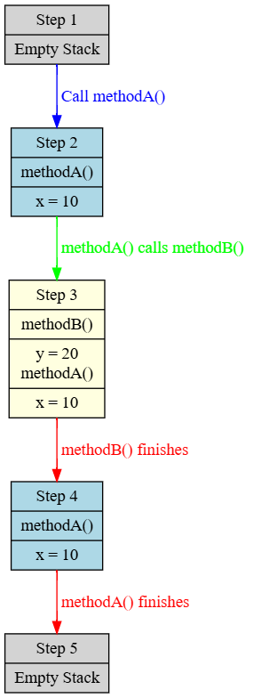
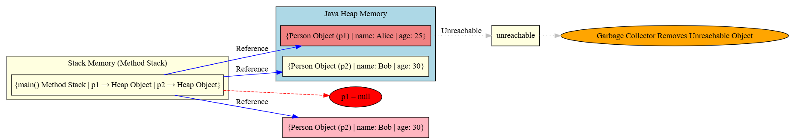

#### Explain Garbage Collection in Java and its benifits?

Garbage Collection (GC) in Java is an automatic memory management process where the Java Virtual Machine (JVM) reclaims memory occupied by objects that are no longer in use. This helps in preventing memory leaks and optimizing application performance.

- the Main objective of Garbage Collector is to **identify unused objects** in order to reclaim memory space.
- It is an Automated Process of **deleting code** that is **no longer used** or needed.

#### Benefits of Garbage Collection in Java

1. **Automatic Memory Management**  
   - Java handles memory deallocation automatically using GC, reducing manual intervention.

2. **Prevention of Memory Leaks**  
   - Unused objects are identified and removed, ensuring optimal memory usage.

3. **Improved Performance**  
   - JVM optimizes GC execution to maintain application responsiveness.

4. **No Manual Deallocation**  
   - Unlike C/C++, Java does not require explicit `free()` or `delete()` calls.

5. **Enhances Security & Stability**  
   - Prevents issues like dangling pointers and memory corruption.

#### How Garbage Collection Works in Java
1. **GC identifies unreachable objects** – Objects with no references become eligible for GC.
2. **GC removes those objects** – JVM reclaims memory by cleaning up unused objects.
3. **Memory is reused** – The freed-up memory is allocated for new objects.

#### Best Practices to Optimize Garbage Collection
- Use **WeakReference** for cache objects.
- Set unused objects to `null` explicitly if they hold large memory.
- Monitor GC performance using **JVisualVM** or **Garbage Collection Logs**.
- Choose an appropriate **GC algorithm** based on your application’s needs.

#### Conclusion
Garbage Collection in Java simplifies memory management by automatically reclaiming unused memory. Understanding different GC algorithms and JVM memory areas helps in optimizing performance for large-scale applications.

---

#### What does `System.gc();` do? 
The following example demonstrates how Java garbage collection works when objects are no longer referenced:

```java
class DemoGC {
    @Override
    protected void finalize() throws Throwable {
        System.out.println("Garbage collected object: " + this);
    }
}

public class GarbageCollectionExample {
    public static void main(String[] args) {
        DemoGC obj1 = new DemoGC();
        DemoGC obj2 = new DemoGC();
        
        // Removing references
        obj1 = null;
        obj2 = null;
        
        //Suggests the Java Virtual Machine (JVM) to run the Garbage Collector (GC), but it does not guarantee that GC will execute immediately.
        System.gc();
        
        // Giving time for GC to complete
        try {
            Thread.sleep(1000);
        } catch (InterruptedException e) {
            e.printStackTrace();
        }
    }
}
```

#### Explanation:
1. We create two objects (`obj1` and `obj2`) of the `DemoGC` class.
2. Both objects are set to `null`, making them eligible for garbage collection.
3. `System.gc();` requests garbage collection, though execution is not guaranteed.
4. The `finalize()` method is overridden to print a message when an object is garbage collected.
5. `Thread.sleep(1000);` ensures enough time for GC to run before the program exits.

#### Conclusion
Garbage Collection in Java simplifies memory management by automatically reclaiming unused memory. Understanding different GC algorithms and JVM memory areas helps in optimizing performance for large-scale applications.

---

#### What Happens When System.gc(); is Called?
- Request Sent to JVM: The call requests the JVM to perform garbage collection.
- JVM Decides Execution: The JVM may choose to ignore this request or execute it when it finds it necessary.
- Eligible Objects Are Collected: If the JVM runs the GC, it will clean up objects that are no longer referenced (like obj1 and obj2 in the example).
- Finalize Method May Run: If an object is garbage collected, its finalize() method (if overridden) will execute before the object is destroyed.

```java 
Example Output:
Garbage collected object: DemoGC@1d44bcfa
Garbage collected object: DemoGC@266474c2

```
---

#### Explain `finalize()` in Java(Depricated from Java 9) ?

The `finalize()` method in Java is a special method that is called by the garbage collector before an object is removed from memory. It was originally designed to allow objects to clean up resources before being destroyed but has been deprecated in recent Java versions due to its unreliability.

#### Syntax
```java
@Override
protected void finalize() throws Throwable {
    System.out.println("Finalize method called");
}
```

#### How It Works
- The garbage collector calls `finalize()` on an object before deallocating memory.
- Each object can override `finalize()` to perform cleanup operations.
- The method is **not guaranteed** to execute at a specific time or even at all.
- It can be called **at most once per object** by the garbage collector.

#### Example
```java
class Demo {
    @Override
    protected void finalize() throws Throwable {
        System.out.println("Finalize method executed");
    }

    public static void main(String[] args) {
        Demo obj = new Demo();
        obj = null; // Making object eligible for garbage collection
        System.gc(); // Requesting garbage collection
        System.out.println("End of main method");
    }
}
```

#### Expected Output (Not Guaranteed)
```
End of main method
Finalize method executed
```
(Note: The execution of `finalize()` depends on the JVM's garbage collection behavior.)

#### Issues with `finalize()`
- ❌ **Unreliable**: JVM decides when to run garbage collection, so `finalize()` may never execute.
- ❌ **Performance Overhead**: Slows down garbage collection if misused.
- ❌ **Deprecated in Java 9**: Java 9 officially deprecated `finalize()` due to its unpredictability.

---
#### What are the Better Alternatives after Java 9?
Instead of using `finalize()`, use the following methods:

| Approach                | Description |
|-------------------------|-------------|
| **Try-with-resources**  | Best for managing resources like files, sockets, and streams. |
| **Explicit Cleanup** (`close()`, `dispose()`) | Provides manual control over resource release. |
| **WeakReferences & java.lang.ref.Cleaner** | A safer and more efficient way to handle object cleanup. |

#### Conclusion
- `finalize()` was used for cleanup before garbage collection.
- It is **not reliable** and has been **deprecated since Java 9**.
- Always prefer **try-with-resources or explicit cleanup methods** for resource management.

---
💡 **Recommendation:** Avoid using `finalize()` and adopt modern cleanup techniques for better performance and reliability.

---
#### Explain Stack and Heap in Java ?

#### Stack Memory
- **Used for:** Storing **method-specific** data (local variables, method calls).
- **Memory Allocation:** **LIFO (Last In, First Out)** principle.
-  **Scope:** Thread-specific (Each thread has its own Stack).
- **Stores:**
   - Local primitive variables (`int`, `double`, etc.).
   - References to objects (actual objects are in Heap).
   - Method execution details (return addresses, function calls).
- **Size:** Small and grows/shrinks with method calls.
- **Access Speed:** Fast (direct memory access).
- **Garbage Collection:** No (automatically removed when method exits).

#### Example:
```java
void methodA() {
    int x = 10;  // Stored in Stack
    methodB();
}
void methodB() {
    int y = 20;  // Stored in Stack
}
```
---

#### Heap Memory
- **Used for:** Storing **objects and instance variables**.
- **Memory Allocation:** **Dynamic (grows as needed)**.
- **Scope:** Shared across all threads.
- **Stores:**
   - Objects (created via `new` keyword).
   - Instance variables (fields of objects).
- **Size:** Larger than Stack.
- **Access Speed:** Slower than Stack (requires reference lookups).
- **Garbage Collection:** **Yes**, managed by Java's **Garbage Collector**.

#### Example:
```java
class Person {
    String name;  // Stored in Heap (part of object)
    int age;      // Stored in Heap (part of object)
}
void createPerson() {
    Person p = new Person();  // 'p' is in Stack, object is in Heap
    p.name = "John";  // Stored in Heap
}
```
---

#### What are the Differences Between Stack and Heap ?

| Feature | Stack Memory | Heap Memory |
|---------|-------------|------------|
| **Used for** | Method calls, local variables | Objects, instance variables |
| **Access Speed** | Fast | Slower |
| **Scope** | Thread-specific | Shared across threads |
| **Size** | Smaller | Larger |
| **Garbage Collection** | No (auto removed on method exit) | Yes (managed by GC) |
| **Lifetime** | Short-lived | Long-lived (until GC clears it) |

Understanding the difference between **Stack and Heap Memory** is essential for optimizing memory management in Java!

---

#### Explain How Stack work in Java for Method calls ?

#### Method Calls and Stack Frames

#### Code Example
```java
void methodA() {
    int x = 10;  // Stored in Stack
    methodB();   // Calls methodB()
}

void methodB() {
    int y = 20;  // Stored in Stack
}
```

#### Step-by-Step Execution with Stack Frames



#### Explanation
- Each method call creates a **new stack frame**.
- Local variables (`x` and `y`) are stored in their respective frames.
- When a method **finishes execution**, its stack frame is removed.
- The stack **follows LIFO (Last In, First Out)** principle.

#### Summary
| Feature           | Stack Memory |
|------------------|--------------|
| **Used for**    | Method calls, local variables |
| **Access Speed** | Fast |
| **Scope**       | Thread-specific |
| **Size**        | Smaller |
| **Garbage Collection** | No (auto removed on method exit) |
| **Lifetime**    | Short-lived |

---

#### Explain Java Heap Memory ?
Java Heap is the memory area where objects are dynamically allocated. It is shared among all threads and managed by the **Garbage Collector (GC)**.

#### Key Features:
- Stores **objects** and **class instances**.
- Managed automatically by **Garbage Collection**.
- **Shared** across multiple threads.
- Objects persist **until they become unreachable**.

---

#### Visualizing Heap Memory Allocation
Consider the following Java code:

```java
class Person {
    String name;
    int age;
    
    Person(String name, int age) {
        this.name = name;
        this.age = age;
    }
}

public class HeapExample {
    public static void main(String[] args) {
        Person p1 = new Person("Alice", 25);
        Person p2 = new Person("Bob", 30);
    }
}
```

#### Steps :


---

#### **When does GC run?**
- When memory is low.
- When `System.gc();` is called (not guaranteed).
- Periodically, based on JVM algorithms.
---

#### Explain Strong Reference vs Weak Reference in Java?

In Java, references determine how objects are stored and garbage collected. The two most common reference types are **Strong Reference** and **Weak Reference**.

---

#### 1. Strong Reference (Default Reference in Java)
A **strong reference** is the normal way objects are referenced in Java. As long as a strong reference exists, the object **will not be garbage collected**.

#### Example of Strong Reference
```java
class StrongRefExample {
    public static void main(String[] args) {
        // Creating a strong reference
        String strongRef = new String("Hello, Java!");

        // Making it null, now it's eligible for GC
        strongRef = null;

        // Suggesting Garbage Collection
        System.gc();

        System.out.println("End of program");
    }
}
```
#### Explanation
- Objects with strong references are **not garbage collected** until explicitly set to `null`.  
- This is the default way objects are referenced in Java.  

---

#### 2. Weak Reference
A **weak reference** allows objects to be garbage collected **even if they are still referenced somewhere**. This is useful in cases like caching where objects should be removed when memory is needed.

#### Example of Weak Reference
```java
import java.lang.ref.WeakReference;

class WeakRefExample {
    public static void main(String[] args) {
        // Strong Reference
        String strongRef = new String("Hello, WeakReference!");

        // Creating a Weak Reference
        WeakReference<String> weakRef = new WeakReference<>(strongRef);

        // Removing Strong Reference
        strongRef = null;

        // Suggest Garbage Collection
        System.gc();

        // Trying to access weak reference
        System.out.println("Weak Reference: " + weakRef.get()); // May print "null" if GC has collected it
    }
}
```
#### Explanation
- If there is no strong reference, GC will remove the object.  
- Used for **caching** and **memory-sensitive applications**.  

---

#### What are the Differences Between Strong and Weak References?

| Feature | **Strong Reference** | **Weak Reference** |
|---------|------------------|----------------|
| **Garbage Collection** | Object is **not** eligible for GC if strongly referenced | Object is eligible for GC even if referenced |
| **Use Case** | Normal objects that should persist in memory | Objects that can be removed when memory is low (caching, maps) |
| **Performance Impact** | Can cause **memory leaks** if not set to `null` properly | Helps in **efficient memory management** |
| **Example** | `String str = new String("Hello");` | `WeakReference<String> weakStr = new WeakReference<>(str);` |

---

#### Real-Time Example: Caching System Using `WeakHashMap`
#### Scenario
Imagine you are building a **user session management system** where user sessions are stored in a cache. However, you don’t want inactive sessions to occupy memory forever. If a session is no longer referenced, it should be **automatically removed**.

#### Example Code
```java
import java.util.Map;
import java.util.WeakHashMap;

class User {
    String name;

    User(String name) {
        this.name = name;
    }

    @Override
    protected void finalize() throws Throwable {
        System.out.println(name + " is garbage collected");
    }
}

public class WeakHashMapExample {
    public static void main(String[] args) throws InterruptedException {
        // Using WeakHashMap to store user sessions
        Map<User, String> userCache = new WeakHashMap<>();

        User user1 = new User("Alice");
        User user2 = new User("Bob");

        // Adding users to the cache
        userCache.put(user1, "Session1");
        userCache.put(user2, "Session2");

        System.out.println("Before GC: " + userCache);

        // Remove strong references
        user1 = null;
        user2 = null;

        // Suggesting garbage collection
        System.gc();

        // Waiting for GC to run
        Thread.sleep(2000);

        System.out.println("After GC: " + userCache);
    }
}
```
#### Output (May Vary)
```
Before GC: {Alice=Session1, Bob=Session2}
Alice is garbage collected
Bob is garbage collected
After GC: {}
```

#### Explanation
- **Before GC**: The `WeakHashMap` holds weak references to the `User` objects.
- **After GC**: Since `user1` and `user2` were set to `null`, they became **eligible for garbage collection**, and `WeakHashMap` automatically removed them.

---

#### When to Use Each Reference Type?

| **Use Case** | **Strong Reference** | **Weak Reference** |
|-------------|------------------|----------------|
| **Normal Object Usage** | ✅ Yes | ❌ No |
| **Caching (e.g., User Sessions, Temporary Objects)** | ❌ No | ✅ Yes |
| **Preventing Memory Leaks** | ❌ No | ✅ Yes |
| **Collections (`WeakHashMap`)** | ❌ No | ✅ Yes |

---

