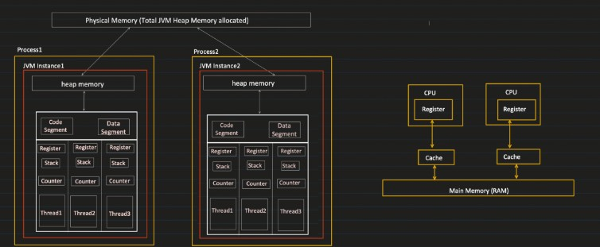

**CPU (Central Processing Unit):** Executes program instructions.

---
**Core:** An independent processing unit within a CPU. More cores enable true parallel execution.
  - Example: A **quad-core processor** can run four tasks simultaneously (e.g., web browser, music player, downloads, system updates).
---
**Program:** A set of instructions written in a programming language (e.g., Microsoft Word).

---
**Process:** An instance of a running program. The OS manages its execution.
  - Example: Opening **Microsoft Word** creates a new process.
  **Thread:** The smallest unit of execution within a process. Threads share resources but execute independently.
  - Example: A **web browser** runs multiple threads—one for rendering, one for JavaScript, one for user input.

---
**Register**

A register is a small, ultra-fast storage location inside the CPU (processor). It’s used to **hold temporary data** that the CPU needs to process instructions, like variables or **intermediate results during calculations**. Registers are the fastest type of memory in a computer because they’re physically part of the CPU itself. 

Examples include:

- **Accumulator**: Holds results of arithmetic operations.  
- **Program Counter (PC)**: Stores the memory address of the next instruction to execute.  
- **Instruction Register (IR)**: Holds the current instruction being executed.  

In the context of Java, registers are managed by the underlying hardware and the Java Virtual Machine (JVM), so you don’t deal with them directly as a programmer.

---
**Stack**
The stack is a region of memory used to **manage function calls, local variables, and program flow**. It operates on a **Last In, First Out (LIFO)** principle:
When a function is called, a **stack frame** is pushed onto the stack, containing local variables, parameters, and the return address.

When the function finishes, its stack frame is popped off, and execution returns to the calling function.

In Java, the **stack memory** is used for:
- Storing primitive local variables (e.g., `int`, `double`).

- Managing method call chains (e.g., keeping track of where to return after a method finishes).

- The stack is fast but limited in size, and if it overflows (e.g., from infinite recursion), you get a `StackOverflowError` in Java.

---
**Counter (Program Counter)**

The counter, often called the **Program Counter (PC)** in computer architecture, is a special register in the CPU that holds the memory address of the next instruction to be fetched and executed in a program. **After each instruction is fetched, the PC is incremented** to point to the next instruction. In the case of jumps or branches (e.g., `if` statements), the PC is updated to a new address.

In Java, the **JVM abstracts this concept**. The JVM’s interpreter or Just-In-Time (JIT) compiler manages instruction flow, so you don’t interact with the program counter directly.

---

**Code Segment**

The code segment (or text segment) is a portion of a program’s memory where the **executable instructions (machine code)** are stored. It’s typically **read-only** to prevent accidental modification during execution. For example:
- In a compiled program, this is where the binary version of your `main()` function or loops resides.

In Java, the code segment **isn’t explicitly exposed to the programmer**. The JVM loads and stores bytecode (compiled .class files) in its own internal memory structures, and the JIT compiler may optimize this into native machine code stored in a code-related area.

---
**Data Segment**
The data segment is a portion of memory used to **store a program’s static or global variables**. It’s divided into:

 - **Initialized Data**: Variables with predefined values (e.g., int x = 5; declared globally).

 - **Uninitialized Data** : Variables declared but not initialized (e.g., int x; globally), typically set to zero by default.

In Java, there’s no direct equivalent to a traditional data segment because the JVM manages memory differently. Static variables in Java (e.g., static int x = 5;) are stored in a special area of the JVM’s memory called the Method Area or Class Data Area, not a classic data segment.

---
**Heap Memory (in Java)**
The heap is a region of memory used for dynamic memory allocation, where objects and data can be created and destroyed at runtime. In Java:
 - **Heap memory** is where all objects (instances of classes) and arrays are allocated. For example, `String s = new String("hello");` creates a `String` object on the heap.

 - It’s **managed by the JVM’s garbage collector**, which automatically frees up memory when objects are no longer referenced.

- The **heap is larger than the stack but slower** to access because it’s dynamically allocated and not as rigidly structured.

Java’s heap is divided into regions like:

**Young Generation:** For newly created objects (further split into Eden, Survivor spaces).

**Old Generation:** For long-lived objects.

**Permanent Generation (pre-Java 8) or Metaspace (Java 8+)**: For class metadata and static data.

If the heap runs out of space, you get an `OutOfMemoryError`.

---

**Physical Heap Memory (in Java)**
There’s no strict term called "physical heap memory" in Java documentation, but this likely refers to the actual physical **RAM allocated to the JVM’s heap by the operating system**. The JVM requests memory from the OS, and the heap size is controlled by parameters like:

`-Xms`: Initial heap size (e.g., `-Xms512m` for 512 MB).

`-Xmx`: Maximum heap size (e.g., `-Xmx2g` for 2 GB).

"Physical heap memory" could also imply the distinction between the logical heap (what the JVM manages) and the physical memory it maps to in RAM. Some heap data might even spill into virtual memory (swap space on disk) if physical RAM is insufficient, though this slows performance significantly.




when you run a Java program:

1. The JVM loads bytecode into memory (into the code segment).

2. Static variables go to the Method Area (like the data segment).

3. The stack tracks method execution, using the program counter internally.

4. Objects are dynamically allocated on the heap, with physical memory backing it.

---
**Monitor Lock**
In Java, a monitor lock (or simply a monitor) is a synchronization mechanism used to **control access to a critical section of code**, ensuring that **only one thread can execute that section at a time**. It is a fundamental part of Java's built-in support for multithreading and is closely tied to the concept of object monitors.

**Every object in Java has an associated monitor**, which is essentially a lock that can be acquired by a thread. When a thread acquires the monitor lock of an object, it gains exclusive access to the synchronized code block or method associated with that object. Other threads attempting to access the same synchronized code will be blocked until the lock is released.

---
**Multitasking:** Running multiple processes simultaneously.
  - **Single-core CPU:** Uses time-sharing (rapid switching).
  - **Multi-core CPU:** Runs tasks in true parallel.
  - Example: Browsing the internet while listening to music and downloading a file.

**Multithreading:** Running multiple threads **within the same process**.
  - Example: A web browser using separate threads for rendering, scripting, and user interaction.

---

**Context Switching**
- **Definition:** The OS saves the state of a running process/thread and loads the next one.
- **Purpose:** Allows multiple processes/threads to share the CPU efficiently.
  - **Single-core CPU:** Creates an **illusion** of parallel execution.
  - **Multi-core CPU:** Enables **true** parallel execution by distributing tasks across cores.

---

**Concurrency**
> Concurrency means executing multiple tasks **in overlapping time periods**, but **not necessarily at the same time**.

**Example**
Imagine you are **singing** and **eating** at the same time. Since both require your mouth, you cannot do them **simultaneously**. Instead, you will **switch between them**, i.e., eat for some time, then sing, then eat again. 

🔹 **Concurrency = Task Switching** (one task at a time, but switching between tasks quickly)

**How It Works in Computers?**
- In a **single-core processor**, concurrency is achieved using **context switching**, where the CPU rapidly switches between tasks.

```plaintext
Task 1 -> Task 2 -> Task 1 -> Task 2 (Switching back and forth)
```

---

**Parallelism**
> Parallelism means executing multiple tasks **simultaneously** at the same time.

**Example**
Imagine you are **cooking** while **talking on the phone**. Both actions can happen at the same time because they use different resources (hands for cooking, mouth for talking).

🔹 **Parallelism = Tasks running at the same time on multiple resources**

**How It Works in Computers?**
- In a **multi-core processor**, tasks can run truly **in parallel**, meaning different tasks run on different cores **without switching**.

```java
Task 1 | Task 2 (Executing at the same time on different cores)
```

---

**How They Are Related?**

✅ **Concurrency enables Parallelism** when multiple cores are available.  
✅ In a **single-core CPU**, tasks execute **one after another** using **context switching**.  
✅ In a **multi-core CPU**, tasks can be executed **truly in parallel** without switching.  

---
